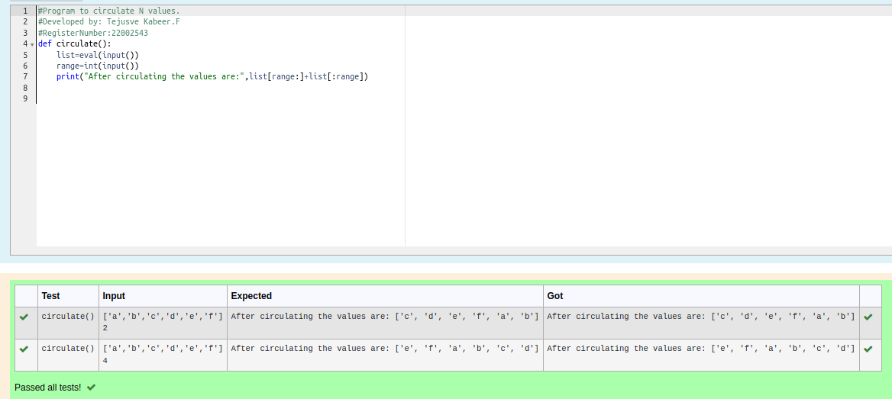

# Circulate-the-values-of-N-variables

## Aim:

To write a python program to circulate the n variables using function concept

## Equipment’s required:

PC Anaconda - Python 3.7

## Algorithm: 

### Step 1: 
create a function with keyword and name

### Step 2: 
get input for the  variable list and range

### Step 3: 

Get the value from the user for the number of rotation
 
### Step 4: 

Using the slicing concept rotate the list

### Step 5: 
the circulated number will be recieved

### Step 6: 
End of the program

## Program:
```python
#Program to circulate N values.
#Developed by: Tejusve Kabeer.F
#RegisterNumber:22002543
def circulate():
    list=eval(input())
    range=int(input())
    print("After circulating the values are:",list[range:]+list[:range])
```
## Output:


## Result:
thus the circulate the values of n variables successfully executed
